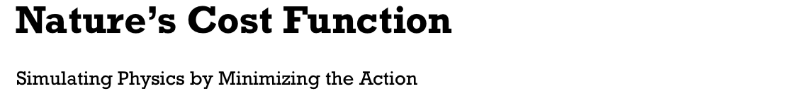
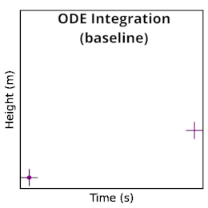
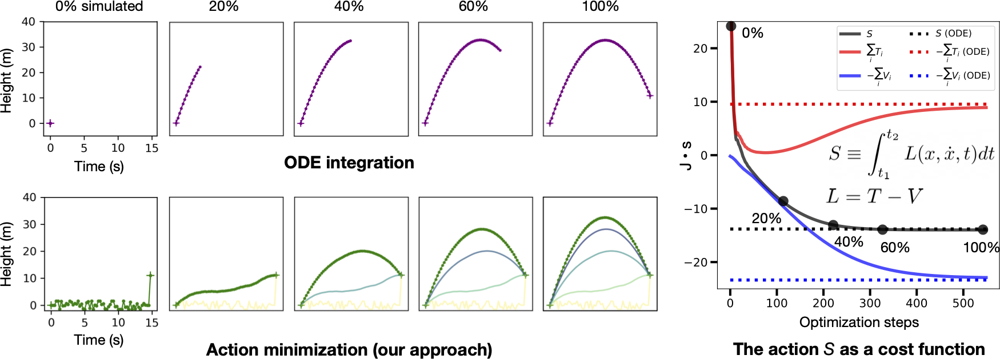
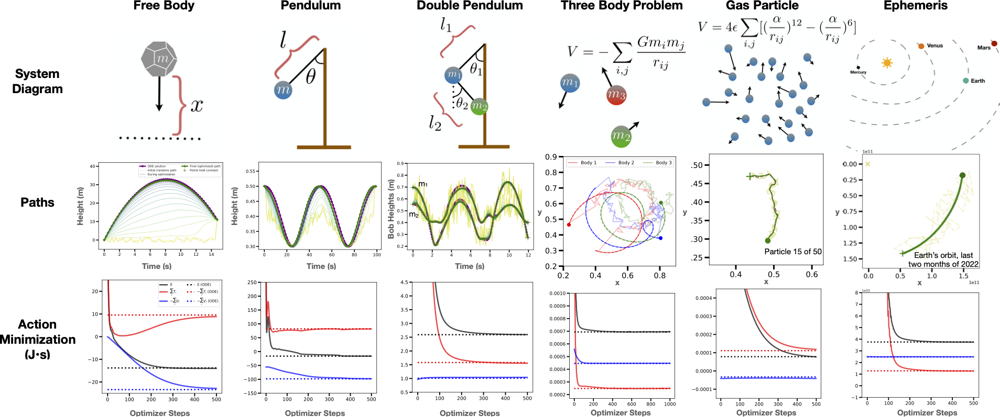
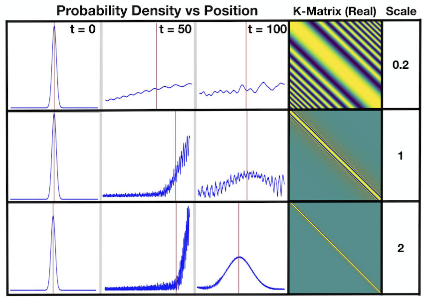

<!-- # Nature's Cost Function: Simulating Physics by Minimizing the Action -->

[Blog post 1](https://greydanus.github.io/2023/03/05/ncf-tutorial/) | [Blog post 2](https://greydanus.github.io/2023/03/12/ncf-six-experiments/) | [Paper](http://arxiv.org/abs/2303.02115)
[Colab: Simple tutorial](https://colab.research.google.com/github/greydanus/ncf/blob/main/tutorial.ipynb) | [Colab: Reproduce paper figures](https://colab.research.google.com/github/greydanus/ncf/blob/main/paper_figures.ipynb) | [Colab: Quantum path integral tutorial](https://colab.research.google.com/github/greydanus/ncf/blob/main/quantum_tutorial.ipynb)

In physics, there is a scalar function called the action which behaves like a cost function. When minimized, it yields the "path of least action" which represents the path a physical system will take through space and time. This function is crucial in theoretical physics and is usually minimized analytically to obtain equations of motion for various problems. In this paper, we propose a different approach: instead of minimizing the action analytically, we discretize it and then minimize it directly with gradient descent. We use this approach to obtain dynamics for six different physical systems and show that they are nearly identical to ground-truth dynamics. We discuss failure modes such as the unconstrained energy effect and show how to address them. Finally, we use the discretized action to construct a simple but novel quantum simulation.

## How to run

* Simple tutorial: [`tutorial.ipnyb`](https://colab.research.google.com/github/greydanus/ncf/blob/main/tutorial.ipynb)
* Reproduce paper figures: [`paper_figures.ipnyb`](https://colab.research.google.com/github/greydanus/ncf/blob/main/paper_figures.ipynb)
* Run the quantum simulation: [`quantum_tutorial.ipnyb`](https://colab.research.google.com/github/greydanus/ncf/blob/main/quantum_tutorial.ipynb)

## Six Experiments
Core physics code can be found in [`core_physics.py`](https://github.com/greydanus/ncf/blob/main/core_physics.py).

* Free body
	* Minimal working example
* Single Pendulum
	* Minimal working example with nonlinearities and radial coordinates
* Double pendulum
	* A chaotic system with sharp nonlinear dynamics
* Three body problem
	* A chaotic system with sharp nonlinear dynamics and N=6 degrees of freedom
* Gas simulation
	* A chaotic system with sharp nonlinear dynamics and N=100 degrees of freedom
* Ephemeris dataset
	* A real physics data taken from the JPL Horizons project
	* One year of orbital data for the sun and the inner planets of the solar system
	* Orbits are projected onto a 2D plane

## Quantum simulation
Code for our quantum experiments can be found in `quantum_tutorial.py`.

<!--  -->

## Depedencies

* PyTorch `pip install torch`
* Pandas `pip install pandas`
* Celluloid (making videos) `pip install celluloid`
